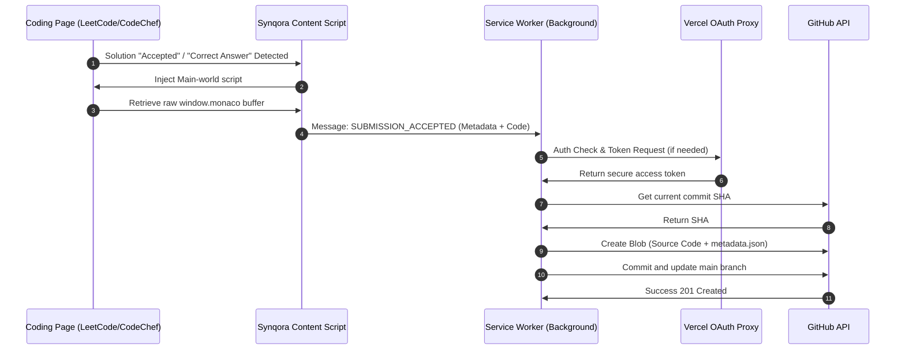

# 🚀 Synqora

<p align="center">
  
  
  
  
</p>

Synqora is a unified, secure, developer-first Chrome extension that automatically synchronizes your accepted coding solutions from **LeetCode, CodeChef, and HackerRank** straight into a personal GitHub repository. 

Build a public coding portfolio effortlessly as you solve challenges!

---

## ✨ Why Synqora?

Most existing synchronization tools are built for a single platform, suffer from styling fragility, or present serious security risks. Synqora was engineered from the ground up to solve these core developer pain points:

| Feature | The Old Way (Others) | **The Synqora Way** |
| :--- | :--- | :--- |
| **Authentication** | Manual PAT copy-paste (Exposes full token scopes) | **1-Click OAuth Flow** (Secure token-exchange proxy) |
| **Multi-Platform** | Multiple extensions needed for different sites | **Unified Router** (LeetCode + CodeChef + HackerRank) |
| **Code Extraction** | DOM Scraping (Fails on long code due to editor virtualization) | **Monaco Buffer Querying** (Extracts directly from browser memory) |
| **Folder Parsing** | Fragile DOM title checking (Breaks when layout updates) | **GraphQL API Queries** (Direct database metadata calls) |
| **Statistics** | Stored in local cache (Resets on new device or cache clear) | **Live Git Trees & Commits Reconstruction** (Stateless live tracker) |

---

## 🛠️ Key Features

### 1. Unified Hub Routing
No more installing separate tools. Synqora detects accepted submissions dynamically on LeetCode, CodeChef, and HackerRank, routes them through a single background sync queue, and pushes them to structured subdirectories:
*   📁 `LeetCode/[Difficulty]/[Problem Name]/Solution.[ext]`
*   📁 `CodeChef/[Difficulty_Bracket]/[Problem Code]/Solution.[ext]`
*   📁 `HackerRank/[Challenge Name]/Solution.[ext]`

### 2. Monaco Editor Memory Querying
Modern coding platforms virtualize the DOM to render only visible lines of code. Standard scrapers truncate long solutions. Synqora executes a script directly in the page's `MAIN` world, bypasses isolation barriers, and queries the active Monaco editor model (`window.monaco.editor`) to extract the **entire code buffer** with absolute fidelity.

### 3. Bulletproof Metadata via GraphQL
On LeetCode, instead of reading volatile class names that change with layout updates, Synqora communicates with LeetCode's public GraphQL API using the problem slug. It pulls the exact problem number, difficulty, and title, ensuring reliability even on submissions detail pages.

### 4. CodeChef Rating Brackets
CodeChef lists numeric difficulty ratings (e.g. `1450`) rather than standard category words. Synqora extracts this rating and dynamically groups it into developer-friendly directories:
*   `< 1000` ➡️ `Beginner`
*   `1000 - 1399` ➡️ `Easy`
*   `1400 - 1799` ➡️ `Medium`
*   `1800 - 2199` ➡️ `Hard`
*   `>= 2200` ➡️ `Challenging`

---

## 📐 Architecture & Data Flow

Here is how Synqora securely routes and commits your code under the hood:



---

## 🚀 Setup & Installation

### Local Installation (Developer Mode)
1.  Clone this repository:
    ```bash
    git clone https://github.com/ASingh2425/code_extension.git
    cd code_extension
    ```
2.  Install dependencies and build the extension:
    ```bash
    npm install
    npm run build
    ```
3.  Open Chrome/Brave and navigate to `chrome://extensions/`.
4.  Toggle **Developer mode** in the top right.
5.  Click **Load unpacked** in the top left and select the compiled **`dist`** folder inside the project directory.

---

## 🔒 Security & OAuth Proxy Deployment

Synqora uses a Serverless OAuth proxy function to securely exchange Github authorization codes for access tokens, avoiding the exposure of credentials.

### Deploying Your Own Proxy (Optional)
This repository includes a serverless Vercel function inside `api/token.ts`. To deploy your own instance:
1.  Register a new **OAuth Application** in your GitHub account (**Settings** ➡️ **Developer settings** ➡️ **OAuth Apps**).
    *   **Authorization callback URL**: `https://<YOUR_EXTENSION_ID>.chromiumapp.org/`
2.  Deploy this workspace to **Vercel** (`vercel --prod`).
3.  Add the environment variables in your Vercel project settings:
    *   `GITHUB_CLIENT_ID` = *[Your GitHub App Client ID]*
    *   `GITHUB_CLIENT_SECRET` = *[Your GitHub App Client Secret]*
4.  Paste your Vercel deployment URL and Client ID into the Synqora Settings page.

---

## 💻 Tech Stack
*   **Extension Core**: TypeScript, HTML5, Vanilla CSS
*   **Build Tooling**: Vite, CRXJS (Chrome Extension Vite Plugin)
*   **Proxy Backend**: Vercel Serverless Functions, Node.js, Fetch API
*   **Source Control Integration**: GitHub REST v3 API, Git Trees/Commits REST endpoints

---

<p align="center">
  Made with ❤️ for the developer community.
</p>
